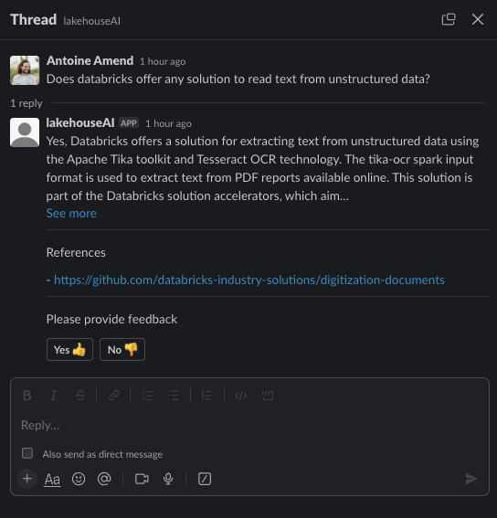
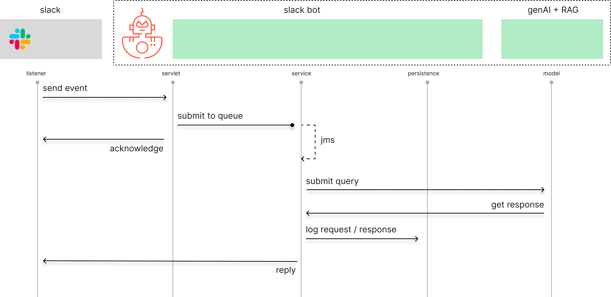
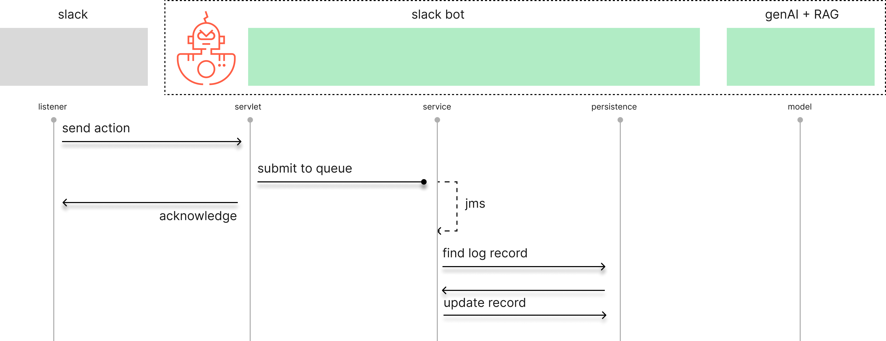
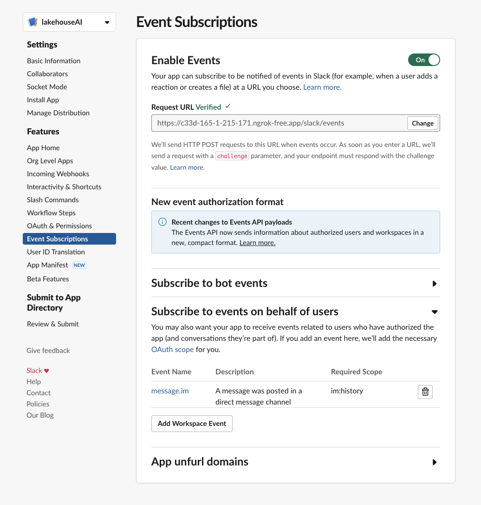

<a href="https://www.databricks.com/solutions/accelerators"></img></a>

# GenAI slack bot

*Sed ut perspiciatis unde omnis iste natus error sit voluptatem accusantium doloremque laudantium, totam rem aperiam,
eaque ipsa quae ab illo inventore veritatis et quasi architecto beatae vitae dicta sunt explicabo.
Nemo enim ipsam voluptatem quia voluptas sit aspernatur aut odit aut fugit, sed quia consequuntur magni dolores
eos qui ratione voluptatem sequi nesciunt. Neque porro quisquam est, qui dolorem ipsum quia dolor sit amet,
consectetur, adipisci velit, sed quia non numquam eius modi tempora incidunt ut labore et dolore magnam aliquam
quaerat voluptatem. Ut enim ad minima veniam, quis nostrum exercitationem ullam corporis suscipit laboriosam,
nisi ut aliquid ex ea commodi consequatur? Quis autem vel eum iure reprehenderit qui in ea voluptate velit esse
quam nihil molestiae consequatur, vel illum qui dolorem eum fugiat quo voluptas nulla pariatur?*

[](https://docs.databricks.com/release-notes/runtime/14.2ml.html)
[](https://databricks.com/try-databricks)
[](https://databricks.com/try-databricks)

___

<antoine.amend@databricks.com>

___

## Motivation and considerations

Everyone can follow some tutorial and build basic POCs on genAI + RAG.
Unfortunately, moving from a POC to actionable LLM requires engineering efforts.

**Out of scope is the RAG model itself** that we delegate to a mlflow serving endpoint on databricks.
For more information, please refer to our gold standard
[demo](https://www.databricks.com/resources/demos/tutorials/data-science-and-ai/lakehouse-ai-deploy-your-llm-chatbot)
that will be kept up to date as new products are released.

While we appreciate we could have used another technology than Java, wrapping business logic and model within
python stack, we wanted to separate both logics on purpose. The rationale is 2 folds:

- Ensure independence of models, offering the ability for user to build different LLMs, different prompts, surfacing
  models via a same endpoint that can easily be load balanced within impacting slack application.
- Ensure engineering reliability and maintainability of a slack application to support larger scale deployments

As a consequence, we relied on Java based application and spring framework to handle our core business logic.

## Business logic



Business logic is split in mainly 2 parts.
Section that listens to incoming messages (events) and write response in threads,
and section that listens to customer feedback (actions) through the use of interactive buttons as per above screenshot.

**Process workflow for event listeners**

Given strict latency requirements from slack applications (< 3sec) and relative latency of any genAI model,
our process is defined as asynchronous, leveraging spring JMS capabilities.
Working for local development to small-medium deployments, the same can be easily upgraded to enterprise message bus
(e.g. kafka) if needed. One may have to modify spring dependencies and configuration.

Since we may want to audit all requests / respond sent to users, we persist our records to an online datastore.
In memory H2 for local development, the same can easily be configured to your database of choice using spring boot
configuration.

Finally, we delegate request together with conversational history (in active thread) to our model on MLFlow.
The latter will handle our RAG strategy and respond back with adequate answer that we attach
back to user thread on slack. Process is defined in high level diagram below.



**Process workflow for action listeners**

For each interaction, we offer the possibility for user to capture customer feedback through the use of
interactive messages (i.e. Yes or No button).
The aim is to be able to adapt your RAG strategy or consider fine-tuning your model.
For that purpose, we leverage our persistence layer by updating our conversation record
with a simple flag (useful or not) together with last updated timestamp.

Similar to our event listener, our process may be handled asynchronously for larger scale deployments.
(though we expect any online datastore to reply in second).
We leverage our JMS component and acknowledge action (i.e. user clicking on button).



## Slack configuration

In order to deploy your first slack bot, you will need to create a slack
application on https://databricks.slack.com/apps. In the following example, we created a new application called
`@LakehouseAI`.

**Enable event listening**


We need to subscribe to both the `app_mention` and `messages.channel` events. While the former will
be triggered any time someone mentions our bot (using 'at' keyword), the latter will be used to monitor
conversation within a given thread and provide our genAI capability with all conversational history for
more relevant output.

The URL of our Java application will be required to start listening to events. Application should support HTTPS and
listens to endpoint `/slack/events`. For local development, a reverse proxy might be needed as per the following
example:

```shell
ngrok http https://localhost:8443
```


According to the image above, our slack event listener will be
`https://ff51-2600-8800-251b-2000-bc57-5fe3-b529-7f89.ngrok-free.app/slack/events`

**Enable interaction**


The message our bot replies back offers the possibility for a feedback loop,
indicating the relevance of our genAI output. Available as a form of "block message", we
need to support interactivity and shortcut. Please note that URL will be the same as per above event listener.



**Enable bot**


Though already available as an application, we won't be able to mention our bot and
kick off genAI augmented conversation without creating our "system user",
marking our newly created bot as online and modifying name, logo and description if needed.

**Ensure scopes are correct**

Most of your application permissions must have been set using configuration above.
For reference, our scopes defined for our bot are as follows.


**Deploy your application**

When installing your application, you will be asked to specify a channel to deploy bot to. Bot will only monitor
actions and events happening in this specific channel.


**Configure your java application**

Finally, report the bot signing key and bot token Id to your java configuration file.

```properties
slack.bot.token=XXXXXXXXXXXXXX
slack.bot.signature.key=XXXXXXXXXXXXXX
```

## Install

Compile project using maven (3.8.5) and Java (11.0.13)

```shell
mvn clean package
```

Run application

```shell
java -jar target/slack-bot-rag-1.0-SNAPSHOT.jar --spring.config.location=/path/to/application.properties
```

Alternatively, package as docker container. The intent would be to run it under our
[Lakehouse Apps](https://www.databricks.com/blog/introducing-lakehouse-apps) motion when GA,
removing as much as burden possible for DevOps teams and offering additional context
(more personalized RAG based on user information and available data).

```shell
mvn spring-boot:build-image
```

## License

© 2023 Databricks, Inc. All rights reserved. The source is provided subject to the Databricks License
[https://databricks.com/db-license-source]. All included or referenced third party libraries are subject to the licenses
set forth below.

| library     | description | license   | source                                                               |
|-------------|-------------|-----------|----------------------------------------------------------------------|
| Spring-boot | J2E         | Apache v2 | https://spring.io/projects/spring-boot                               |
| bot-servlet | Slack API   | Apache v2 | https://mvnrepository.com/artifact/com.slack.api/bolt-servlet/1.36.0 |
